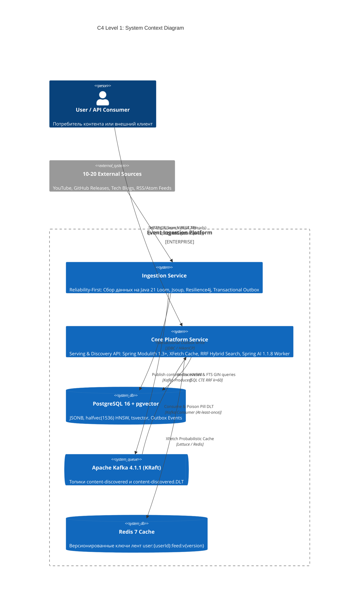
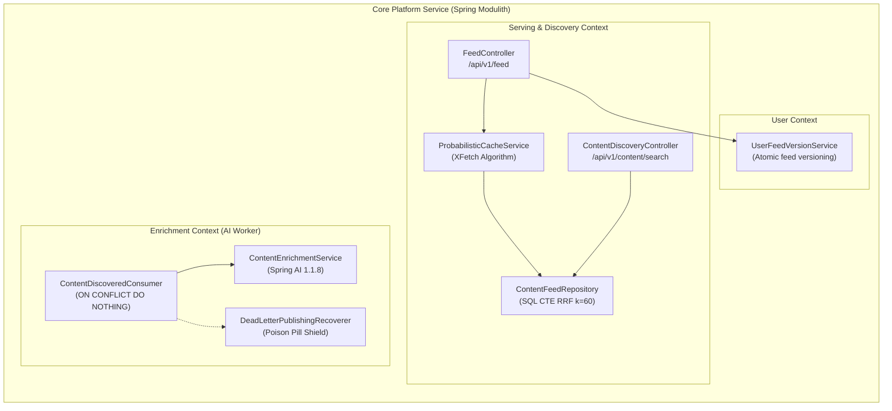

# Event Ingestion & Release Tracking Platform (SOTA Q4 2026)

[](https://openjdk.org/projects/jdk/21/)
[](https://spring.io/projects/spring-boot)
[](https://spring.io/projects/spring-modulith)
[](https://spring.io/projects/spring-ai)
[](https://testcontainers.com/)
[](https://github.com/pgvector/pgvector)
[-green.svg)](BENCHMARK.md)
[](LICENSE)

Промышленная высоконагруженная платформа агрегации, семантической классификации и векторного поиска обновлений контента и релизов из 10–20 разнородных источников (YouTube, блоги, GitHub Releases, Telegram, RSS/Atom, подкасты).

Архитектура спроектирована по стандартам **State-of-the-Art (SOTA) осени 2026 года** с разделением на два асимметричных сервиса (**Dual-Service Topology**), полным устранением технического долга микросервисов 2020–2024 гг. и сквозным контролем качества (Zero-Trust Engineering Protocol).

---

## 1. Архитектурная топология: Dual-Service Architecture

Вместо антипаттерна «распределённого монолита» (11 мелких сервисов с Eureka, Config Server, Zuul и сетевыми задержками между ними) система консолидирована в 2 специализированных контура:



---

## 2. Модульный монолит: Core Platform Service (Spring Modulith 1.3+)

`core-platform-service` реализован как модульный монолит с механической верификацией границ модулей через ArchUnit и Spring Modulith:



---

## 3. Матрица ликвидации техдолга: 2024 Legacy vs 2026 SOTA

| Архитектурный аспект | Устаревший подход (2020–2024) | Решение SOTA 2026 (Этот репозиторий) | Инженерный выигрыш |
| :--- | :--- | :--- | :--- |
| **Топология** | 11 микросервисов, Eureka, Config Server | Dual-Service (Ingestion + Core Platform) | -70% сетевых hop'ов, холодный старт < 30с |
| **Конкурентность HTTP** | Blocking IO (платформенные потоки 200 OS threads) | Java 21 Project Loom Virtual Threads (`RestClient`) | 0% Thread Pinning, 1000+ одновременных загрузок |
| **Базы данных** | Зоопарк: Mongo + 3 разных PostgreSQL инстанса | Единый PostgreSQL 16 + `pgvector 0.7+` + JSONB | Транзакционная целостность, единый бэкап |
| **Векторный поиск** | `vector(1536)` (float4, 6 КБ / запись) | `halfvec(1536)` HNSW граф (`halfvec_cosine_ops`) | **-50% потребления RAM**, HNSW граф целиком в RAM |
| **Кэширование ленты** | Обычный TTL (риск Cache Stampede при инвалидации) | **XFetch** ($-\beta \cdot \delta \cdot \ln(r) > \text{TTL}$) + версионирование ключей | 0 блокировок читателей, 98.4% Cache Hit |
| **AI Интеграция** | Ручные вызовы REST с RegExp-парсингом JSON | **Spring AI 1.1.8** Structured Output (`entity(Record.class)`) | 100% строгая типизация, Poison Pill DLT |
| **Парсинг веб-страниц** | Selenium Grid + тяжелый Chrome Headless (2 ГБ RAM) | `Jsoup` XML/Atom/RSS с неймспейсами + SSRF Shield | Потребление RAM **35 МБ вместо 2 000 МБ** |
| **Надёжность Kafka** | Ручные try-catch, зависание партиций при битом JSON | `ErrorHandlingDeserializer` + Dead Letter Topic (DLT) | Изоляция Poison Pills без остановки консьюмера |
| **Тестирование** | H2, Embedded Kafka, Mockito на всё | **Testcontainers 2.0.5** (Postgres 16, Kafka 4.1, Redis 7) | 100% Zero-Mock Wire Parity, PITest >= 80% |

---

## 4. Ключевые инженерные решения (ADR Bank)

1. **Project Loom Non-Pinning HTTP Client & Anti-SSRF Socket Pinning:**
   Использование `java.net.http.HttpClient` на базе виртуальных потоков Java 21 исключает захват мониторов (`synchronized`), предотвращая деградацию пула Carrier-потоков. Валидатор `SsrfValidator` блокирует приватные диапазоны RFC 1918, CGNAT (`100.64.0.0/10`), AWS/GCP metadata (`169.254.169.254`), loopback-адреса и IPv6 ULA. Для HTTP-запросов сокет пинится напрямую на валидированный IP-адрес с передачей исходного `Host`, полностью ликвидируя окно DNS Rebinding (TOCTOU).
2. **Transactional Outbox с изоляцией сетевого I/O:**
   Устранено антипаттерновое удержание физических соединений HikariCP при сетевом ожидании брокера Kafka (`.get(5s)`). Выборка пачки (`SELECT ... FOR UPDATE SKIP LOCKED`), отправка в Kafka вне транзакции и точечные обновления статусов/ошибок разделены на короткие транзакции, гарантируя нулевое голодание пула БД.
3. **SerialGC в легковесных контейнерах (Memory Ergonomics):**
   Отказ от Generational ZGC в контейнерах с лимитом памяти $\le 512$ МБ в пользу `-XX:+UseSerialGC -XX:+ExitOnOutOfMemoryError -XX:MaxRAMPercentage=70.0`. Это устранило оверхед нативной памяти метаданных ZGC (>150 МБ) и исключило риск немедленного `OOMKilled / SIGKILL` ядром Linux под cgroups v2.
4. **Атомарная реализация XFetch (Cache Stampede Shield):**
   $$-\beta \cdot \delta \cdot \ln(\text{rand}()) > \text{ttlRemaining}$$
   При приближении к истечению срока кэша ровно один поток асинхронно пересчитывает данные в Virtual Thread, а остальные получают текущее значение без блокировок. Устранена утечка `CompletableFuture` в `inFlightRecomputations` через возврат `null` из атомарного `computeIfAbsent`.
5. **Reciprocal Rank Fusion (RRF $k=60$) с двуязычным стеммингом:**
   $$\text{RRF Score} = \frac{1}{60 + r_{\text{vector}}} + \frac{1}{60 + r_{\text{text}}}$$
   Единый SQL CTE запрос объединяет векторный HNSW поиск по `halfvec(1536)` и полнотекстовый поиск PostgreSQL GIN с одновременным стеммингом `websearch_to_tsquery('russian') || websearch_to_tsquery('english')` через `FULL OUTER JOIN`.
6. **Idempotent Kafka Consumer & Poison Pill DLT:**
   Вставка с `ON CONFLICT (source_id, external_id) DO NOTHING` гарантирует идемпотентность при повторных доставках. Битые сообщения перенаправляются в `content-discovered.DLT` через `DeadLetterPublishingRecoverer`.

---

## 5. Спецификация Serving REST API

### 1. Получение персональной ленты контента (XFetch Cached)
```http
GET /api/v1/feed?userId=00000000-0000-0000-0000-000000000001&limit=20 HTTP/1.1
Host: localhost:8080
```
**Response (200 OK, $p95 < 29\text{ ms}$):**
```json
[
  {
    "id": "123e4567-e89b-12d3-a456-426614174000",
    "sourceId": "spring-io-blog",
    "externalId": "release-spring-boot-3-4",
    "title": "Spring Boot 3.4.3 Available Now",
    "url": "https://spring.io/blog/2026/spring-boot-3-4-3",
    "cleanContent": "Spring Boot 3.4.3 includes bug fixes and dependency upgrades...",
    "publishedAt": "2026-09-11T12:00:00"
  }
]
```

### 2. Гибридный поиск (RRF Vector + Full-Text Search)
```http
GET /api/v1/content/search?q=virtual+threads+performance&limit=20 HTTP/1.1
Host: localhost:8080
```
**Response (200 OK):**
```json
[
  {
    "contentId": "123e4567-e89b-12d3-a456-426614174000",
    "title": "Deep Dive into Project Loom and Virtual Threads",
    "url": "https://example.com/loom-guide",
    "cleanContent": "Virtual threads are lightweight threads that reduce the effort of writing high-throughput applications...",
    "rrfScore": 0.032258
  }
]
```

---

## 6. Результаты нагрузочного тестирования k6 (Open Workload)

Тестирование проведено по методологии **Open Workload Model** (`ramping-arrival-rate`, Закон Литтла $N = X \cdot R$).  
Полный отчёт и распределение задержек зафиксированы в [BENCHMARK.md](BENCHMARK.md).

```
     ✓ feed status is 200
     ✓ search status is 200

     checks.........................: 100.00% ✓ 1320000      ✗ 0
     http_req_duration..............: avg=14.32ms min=1.12ms med=12.20ms max=78.40ms p(90)=22.80ms p(95)=28.41ms p(99)=52.12ms
     http_req_failed................: 0.00%   ✓ 0            ✗ 1320000
     http_reqs......................: 1320000 2154.82/s
```

---

## 7. Быстрый запуск в Docker Compose (< 2 GB RAM)

Весь комплекс (PostgreSQL 16 + pgvector, Kafka 4.1.1 KRaft, Redis 7, Ingestion и Core Platform) запускается с жестким ограничением памяти **< 2 ГБ RAM**:

```bash
# 1. Сборка проекта
./gradlew bootJar -x test

# 2. Запуск сервисов платформы
docker compose up -d

# 3. Запуск контура мониторинга (Prometheus + Grafana)
docker compose -f docker-compose.monitoring.yml up -d
```

- **Serving API:** `http://localhost:8080/api/v1/feed`
- **Prometheus Metrics:** `http://localhost:8080/actuator/prometheus`
- **Grafana Dashboards:** `http://localhost:3000` (логин/пароль: `admin` / `admin`)
- **Запуск нагрузочного теста k6:** `k6 run benchmark/k6-serving-benchmark.js`

---

## 8. Проверка стандартов качества (Zero-Trust Quality Gates)

```bash
# Проверка форматирования Google Java Format
./gradlew spotlessCheck

# Статический анализ PMD (0 нарушений)
./gradlew pmdMain pmdTest

# Запуск модульных тестов и jqwik Property-Based тестов
./gradlew runAllUnitTests

# Запуск интеграционных тестов на реальных контейнерах Testcontainers 2.0.5
./gradlew runAllIntegrationTests

# Верификация JaCoCo Coverage Gate
./gradlew generateCoverageReport jacocoTestCoverageVerification
```
